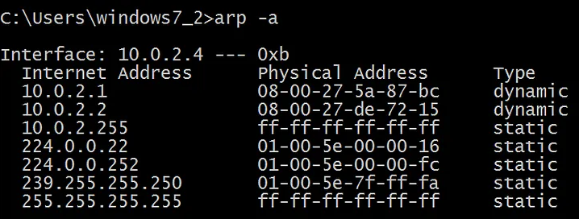
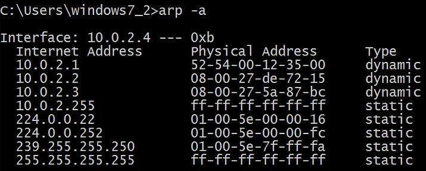
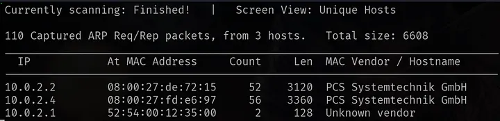
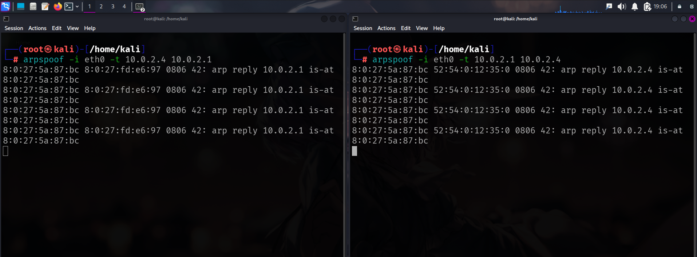
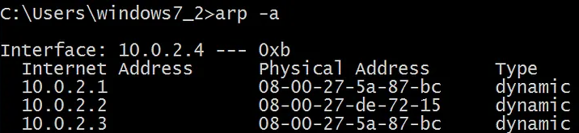
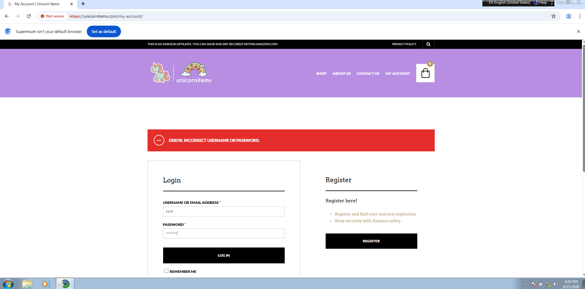
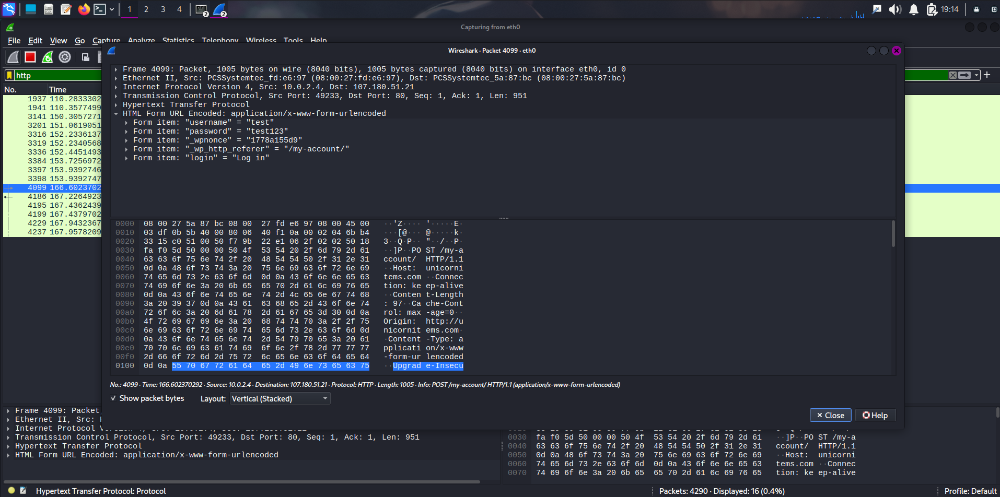

# My Lab Environment and First MITM Attack
Welcome to my first cybersecurity write-up. In this write-up, I will be sharing how I configured an isolated lab environment using VirtualBox and executed my first ever Man in the Middle (MITM) attack, also known as ARP spoofing attack.

As for my lab environment, I downloaded and installed both Kali and Windows 7 machines. Then I set up a NAT Network for them, an isolated network for these machines to communicate.

I ran commands to see their IP addresses, `ifconfig` on Kali and `ipconfig` on Windows. The IP address of the Windows machine was 10.0.2.4, whilst Kali’s was 10.0.2.3.

I needed them to be able to see each other, so I ran `arp -a` on Windows. There, I stumbled upon an issue.



Kali’s IP address was not there because the two machines hadn’t communicated yet, so I made sure it could see Kali by typing `ping 10.0.2.3`. It is essential for us to see Kali’s MAC address but I will get on that later. After pinging, I ran `arp -a` again and there it was, our Kali.



I ran the command below on Linux:

```netdiscover -i eth0 -r 10.0.2.0/24 -c 100```

As for the parameters, I used `-i eth0` to specify the interface, which is the interface connected to my NAT network. `-r` specifies which range the command should cover and I used it with a CIDR notation. `-c` is for count. It specifies how many ARP requests will be sent to each host.



Now for the attack part, first thing I did was IP forwarding. It is necessary because victim’s packets and gateway’s packets will be directed to us. But if there is no forwarding, the victim can’t go on the internet and this may raise suspicion. To forward IPs, I ran the command below:

echo 1 > /proc/sys/net/ipv4/ip_forward
IP forwarding is set to 0 by default. Because this change is made dynamically in memory, it resets upon every reboot, meaning you need to re-enable it.

I opened two separate terminal windows on Kali. I ran the first command below, which tells the gateway that we are Windows (-t being target):

```arpspoof -i eth0 -t 10.0.2.1 10.0.2.4```
Then, in a second terminal, I ran a modified version, which tells Windows that we are the gateway:

```arpspoof -i eth0 -t 10.0.2.4 10.0.2.1```



I ran `arp -a` again on Windows to see if my Kali’s MAC address is the same as gateway’s.



As you can see, the gateway’s and Kali’s MAC addresses are the same in the table, meaning Windows now thinks Kali’s MAC address belongs to the gateway.



I went to this HTTP site, and it was an HTTP site because it is easier to capture some important credentials, like login info. You can’t do that easily on HTTPS sites because they use HTTP + TLS, a much more secure protocol called Transport Layer Security.



Then I opened up Wireshark to see if I could capture anything. I applied a filter to isolate HTTP packets. After a bit of digging through POST-tagged packets, our login info was there.

This exercise showed me how easily unencrypted traffic can be intercepted on a local network once an attacker sits between two devices. It’s also a clear example of why HTTPS matters. If that login page had used TLS, the credentials I captured would have been encrypted and effectively useless to me. Overall, this was a good first hands-on look at how something as simple as ARP, a protocol with no built-in authentication, can be exploited to break trust between devices on a network.
